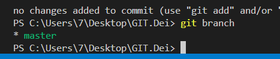

# Установка Git и Visual Studio Code

➤Установка Git для Windows, MAC, Linux: https://git-scm.com/downloads

➤Установка VSCode для Windows, MAC, Linux: https://code.visualstudio.com/Download
При первом использовании Git необходимо представиться. Для 
этого нужно ввести в терминале 2 команды:
git config --global user.name «Ваше имя английскими буквами» git 
config --global user.email ваша почта@example.com

**Что такое Git и зачем он нужен?**

Git - это консольная утилита, для отслеживания и ведения истории изменения файлов, в вашем проекте. Чаще всего его используют для кода, но можно и для других файлов. Например, для картинок - полезно для дизайнеров.
С помощью Git-a вы можете откатить свой проект до более старой версии, сравнивать, анализировать или сливать свои изменения в репозиторий.
Репозиторием называют хранилище вашего кода и историю его изменений. Git работает локально и все ваши репозитории хранятся в определенных папках на жестком диске.
Так же ваши репозитории можно хранить и в интернете. Обычно для этого используют три сервиса:

# Основные команды Git

✦ git init – инициализация локального репозитория

✦ git status – получить информацию от git о его текущем состоянии

✦ git add – добавить файл или файлы к следующему коммиту

✦ git commit -m “message” – создание коммита.

✦ git log – вывод на экран истории всех коммитов с их хеш-кодами

✦ git checkout – переход от одного коммита к другому

✦ git checkout master – вернуться к актуальному состоянию и продолжить работу

✦ git diff – увидеть разницу между текущим файлом и закоммиченным файлом

# Синтаксис языка Markdown

Справочник по Markdown от Microsoft:
https://docs.microsoft.com/ru-ru/contribute/markdown-reference

✦ # Заголовок – выделение заголовков. Количество символов “#” задаёт уровень заголовка 
(поддерживается 6 уровней).
# заголовок 1
## Заголовок 2
### Заголовк 3
#### Заголовок 4
##### Заголовок 5
###### Заголовок 6
✦ = или - – подчёркиванием этими символами (не менее 3 подряд) выделяют заголовки первого 
(“=”) и второго (“-”) уровней.
## Выделение текста (emphasis)
Чтобы изменить начертание текста, нужно выделить его с двух сторон спецсимволами следующим образом: <спецсимвол>текст<спецсимвол>.
### Жирный (bold)
Для выделения текста жирным нужно использовать две звёздочки ** или два нижних подчёркивания __.

✦ **Полужирное начертание** или __Полужирное начертание__

### Курсив (italic)
Для выделения текста курсивом нужно использовать одну звёздочку * или нижнее подчёркивание _.<br>
✦ *Курсивное начертание* или _Курсивное начертание_ <br>

### Жирный курсив (bold and italic)
Для выделения текста сразу обоими стилями нужно использовать три звёздочки *** или три нижних подчёркивания ___.<br>
✦ ***Полужирное курсивное начертание***

### Зачёркнутый (strikethrough)
Чтобы зачеркнуть текст, нужно использовать две тильды ~~. Такая опция есть только в диалекте GitHub Flavored Markdown.
✦ ~~Зачёркнутый текст~~

✦ *Строка – ненумерованные списки, символ “*” в начале строки

✦ 1, 2, 3 … – нумерованные списки

# Гайд по синтаксису языка разметки Markdown

## Диалекты и редакторы

Базовым Markdown уже мало кто пользуется. Зато у него существуют спецификации и диалекты, которые добавляют в язык новые функции: встраивание HTML-тегов, создание таблиц и чекбоксов, зачёркивание текста, разные варианты переноса строки.
Разные редакторы Markdown могут поддерживать или не поддерживать часть новых функций — учтите это при выборе платформы, на которой будете работать.
Самый распространённый Markdown — диалект GitHub Flavored Markdown, основанный на спецификации CommonMark. В этой статье мы пользуемся редактором Markdown Editor, который поддерживает практически все инструменты этой парочки (кроме чекбоксов).

## Параграфы и разрывы строк (paragraphs and line breaks)

Чтобы поделить текст на параграфы, между ними нужно оставить пустую строку. Строка считается пустой, даже если в ней есть пробелы и табуляции. Если же строки находятся рядом, то они автоматически склеиваются в одну.

Для переноса строки внутри одного параграфа есть три метода:
поставить в конце строки два или больше пробела   ;

поставить в конце строки обратную косую черту \;

использовать HTML-тег <br>

Обратите внимание, что у каждого из методов есть свои недостатки:
1.пробелы в конце строки бывает трудно заметить, и это может запутать читателя;

2.обратный слеш вводится в стандарте CommonMark и может поддерживаться не всеми редакторами;

3.HTML-теги в Markdown также поддерживаются не всеми редакторами.

## Заголовки (headings)
В синтаксисе Markdown есть шесть уровней заголовков: от H1 (самого большого) до H6 (самого маленького). Для их выделения используют решётки #, при этом есть несколько тонкостей:

*решётки можно ставить как перед заголовком, так и с двух сторон от него (на уровень заголовка влияют только те #, которые находятся перед ним);

*количество решёток соответствует уровню заголовка: одна для первого уровня, две для второго и так далее;
между решёткой и текстом ставится пробел.

*У заголовков первого и второго уровня есть альтернативный способ выделения: на следующей строке после них нужно поставить 

знаки равенства = или дефисы -. Вот несколько правил:

*знак = применяется для заголовков H1;

*дефис применяется для заголовков H2;

*если в одной строке поставить оба знака, то работать ничего не будет;

*можно ставить любое количество знаков, и на тип заголовка это не повлияет;

*между заголовком и знаками не должно быть пустых строк.

### Подчёркнутый (underline)
В синтаксисе Markdown нет встроенного способа подчеркнуть текст. Но если ваш редактор поддерживает HTML, то можно использовать теги:
<u>Подчёркнутый текст</u>

### Разделители (horizontal rules)
Чтобы оформить горизонтальный разделитель, нужно поставить три или больше специальных символа: звёздочки *, дефиса - или нижних подчёркивания _. Они должны находиться на отдельной строке, и между ними можно ставить любое количество пробелов и табуляций.

Если ваш редактор поддерживает HTML-теги, то для разметки можно также использовать тег <hr>.

## Цитаты (blockquotes)
Чтобы параграф отобразился как цитата, нужно поставить перед ним закрывающую угловую скобку >. Внутрь одного блока цитаты можно поместить сразу несколько параграфов и использовать любые элементы оформления. Например, заголовки и другие цитаты. Чтобы сделать это, нужно поместить закрывающую угловую скобку перед началом каждой строки.

## Списки (lists)
В синтаксисе Markdown есть несколько видов списков. Для их оформления перед каждым пунктом нужно поставить подходящий тег и отделить его от текста пробелом.
### Чекбоксы (checkboxes)
Чтобы сделать чекбоксы, нужно использовать маркированный список, но между маркером и текстом поставить [x] для отмеченного пункта и [] — для неотмеченного.

Чекбоксы доступны в диалекте GitHub Flavored Markdown (тот самый, который умеет зачёркивать текст) и поддерживаются не всеми редакторами Markdown. Например, нам для демонстрации примера пришлось открывать другой.

### Вложенные (nested)
Чтобы создать вложенный список, нужно поставить перед его пунктами табуляцию или несколько пробелов. В Markdown одна табуляция соответствует четырём пробелам.

Список одного вида можно вкладывать в любой другой.На самом деле количество пробелов, которые нужно поставить для корректного отступа, рассчитывается чуть сложнее. Берётся количество символов в маркере (один для *, - и +, два для 1., три для 10.), и к нему прибавляется любое число от 1 до 4.

Таким образом, если в маркере 1 символ, нужно поставить от 2 до 5 пробелов, если 2 символа — от 3 до 6, если 3 символа — от 4 до 7.

### Другие элементы внутри списков
В пункты списков можно добавлять другие элементы оформления. Например, параграфы или цитаты. Для этого нужно сделать отступ, как если бы вы добавляли вложенный список.

## Ссылки (links)
Самый лёгкий способ поместить ссылку в Markdown — заключить её в угловые скобки. Несмотря на простоту, он не является основным и был добавлен только в спецификации CommonMark.

<https://skillbox.ru/media/code/>

Чтобы оформить ссылкой часть текста, используется такой синтаксис: [текст](ссылка). Можно сделать всплывающую подсказку при наведении курсора. Для этого в круглых скобках после ссылки нужно поставить пробел и написать текст подсказки в кавычках.

[Skillbox Media](https://skillbox.ru/media/) без подсказки

[Skillbox Media](https://skillbox.ru/media/ "Всплывающая подсказка") с подсказкой

Ещё один способ оформить ссылку — справочный. Он работает как сноски в книгах: [текст][имя сноски]. При таком способе организации ссылок в конце документа нужно также написать и оформить саму сноску: [имя сноски]: ссылка. При желании после ссылки можно добавить подсказку — точно так же, как в предыдущем методе.

Имя сноски может быть любым сочетанием символов: цифрами, буквами и даже знаками препинания. На одну и ту же сноску в тексте можно ссылаться сколько угодно раз.

Ссылки, оформленные справочным методом, выглядят и работают точно так же, как и в предыдущем способе. Сами сноски в отформатированном документе не отображаются.

## Картинки (images)
Изображения в Markdown оформляются по принципу, схожему с принципом оформления ссылкок, только перед квадратными скобками нужно поставить восклицательный знак: . Здесь также можно сделать всплывающую подсказку.


В Markdown есть несколько способов выделить исходный код:

*Если надо отобразить фрагмент кода внутри строки с каким-то текстом, нужно с двух сторон выделить этот код одним или несколькими обратными апострофами (`; их ещё называют бэктиками).

*Чтобы выделить фрагмент из нескольких строк, нужно с двух сторон выделить его тремя обратными апострофами.

*Также перед фрагментом кода можно поставить табуляцию или четыре пробела, при этом предыдущая строка должна быть пустой.

Если обрамлять код тремя обратными апострофами, то после первой тройки можно указать язык программирования — тогда Markdown правильно подсветит элементы кода.Возможность вставлять блоки кода тремя обратными апострофами появилась в спецификации CommonMark, но там не указан список псевдонимов: как правильно называть языки, чтобы Markdown понял, о чём речь.

Поэтому каждая реализация ведёт свой собственный список языков и их псевдонимов. Так как их очень много, да ещё и новые время от времени добавляются, то удобных таблиц обычно не делают. Предлагают сразу ознакомиться с конфигурационным файлом.

Вот такой список языков, например, поддерживает диалект GitHub Flavored Markdown.

## Таблицы (tables)
В уже упомянутом выше диалекте GitHub Flavored Markdown (и некоторых других тоже) есть возможность оформлять таблицы. Столбцы разделяются вертикальными линиями |, а строка с шапкой отделяется от остальных дефисами -, которых можно ставить сколько угодно.

|Столбец 1|Столбец 2|Столбец 3|
|-|--------|---|
|Длинная запись в первом столбце|Запись в столбце 2|Запись в столбце 3|
|Кртк зпс| |Слева нет записи|

Чтобы выровнять весь столбец по правому краю, в строке с дефисами сразу после дефисов можно поставить двоеточие :. Чтобы выровнять содержимое по центру, надо поставить двоеточия с обеих сторон.

|Столбец 1|Столбец 2|Столбец 3|
|:-|:-:|-:|
|Равнение по левому краю|Равнение по центру|Равнение по правому краю|
|Запись|Запись|Запись|

## Экранирование (escaping characters)
Многие символы в Markdown выполняют роль служебных. Если они встречаются в вашем тексте сами по себе, то для корректного отображения их стоит экранировать (иначе они просто не только не отобразятся сами, но и добавят вашему тексту какое-нибудь ненужное форматирование). Для этого перед ними ставится обратная косая черта \.

Вот список символов, которые нужно экранировать: \`*_{}[]<>()#+-.! |. Делать это постоянно необязательно — достаточно ставить экран только в тех случаях, когда Markdown может воспринять эти символы как служебные. Например, если строка начинается с символа #, то экранировать её надо — потому что программа может решить, что вы хотите сделать заголовок. А вот если решётка находится где-то в центре строки, то экранировать ничего не надо — редактор поймёт, что тут она просто часть текста.

## Резюмируем
Этой шпаргалки по разметке Markdown будет достаточно для создания полноценного документа. А там, где возможностей языка не хватит, можно встраивать HTML-код.

Синтаксис Markdown простой, гибкий и нетребовательный. У него есть несколько реализаций, благодаря которым в нём можно:

*выделять параграфы и переносить строки,<br>
*оформлять заголовки,<br>
*изменять начертание текста,<br>
*ставить горизонтальные разделители,<br>
*выделять цитаты,<br>
*составлять списки,<br>
*прикреплять ссылки,<br>
*вставлять картинки и исходный код,<br>
*делать таблицы.<br>

И ещё одно небольшое примечание. Если вы форматируете текст с помощью HTML-тегов или форматируете код тремя обратными апострофами, то Markdown будет автоматически пытаться искать закрывающий символ — то есть будет придумывать, куда его поставить, даже если у вас его нет. Остальные симметричные символы (*_~`) работают в пределах одной строки.

## Создание коммитов
### Git add
Для добавление изменений в коммит используется команда ```git add``` и имя файла<br>
Например, ```git add README.md```


### Оправить коммит
```git commit -m "first commit"``` - команда для отправки коммита<br>
* ```git commit``` - обращение к **GIT**
* ```-m``` - добавить сообщение *(коментарий)*
* ```"first commit"``` - коментрарий *(в кавычках)*


### Посмотреть список коммитов
* ```git log``` - стандартный вид


* ```git log --graph``` - вид с графическим отображением веток

![p]pucture/(ветки.png)
### Перейти к сохранению
* ```git checkout```
* ```git checkout <номер коммита, первые 4 символа>``` - перейти к определенному изменению
* ```git master``` - перейти к изменению последнего коммита
### Посмотреть есть ли не сохранненные изменения репозитория (файлов)
* ```get status```


## Работа с ветками
* ```git branch``` - посмотреть список веток


* ```git branch <название ветки>``` - создать ветку (новая ветка унаследует коммиты родительской ветки)

* ```git checkout <название ветки>``` - перейти на ветку

* ```git branch -d <название ветки>``` - удалить ветку после merge

* ```git branch -D <название ветки>``` - удалить ветку принудительно

* ```git merge <название сливаемой ветки>``` - сливание веток


## конфликт 


# Шпаргалка для коммитов
## Как писать сообщения для коммитов
Команда, которая позволяет оставить сообщение для коммита: **git commit -m**

Общие правила написания сообщений
для коммитов:
* лаконично,
* однородно,
* осознанно.

<< Старайтесь писать комментарии по-английски — это считается хорошим тоном. Но Git
понимает кириллицу, и писать комментарии на русском можно, например, в том случае,
если вы на 100% уверены, что ваш код будет интересен только русскоязычной аудитории. >>
## Пишите сообщения с заглавной буквы
* Хорошо. 
"Add 'get' method to post model"
* Плохо.
"add 'get' method to post model"
## Не используйте прошедшее время
* Хорошо.
"Fix the bug in the function 'set'"
*  Плохо.
"Fixed bug in the function 'set'"

Чтобы составлять сообщения в нужном формате было проще, воспользуйтесь одним из лайфхаков:
1. Представьте, что вы обращаетесь к Git: «Git, добавь», «Git, удали».
2. Подставьте строку сообщения во фразу If applied, this commit will … :
If applied, this commit will <сообщение для коммита>
## По возможности указывайте на исходный код в сообщении
* Хорошо.
"If applied, this commit will
fix the bug in the function 'set'"
* Плохо.
"If applied, this commit will
fix the bug"
## Пишите осмысленные сообщения
При написании сообщений для коммитов можно пользоваться формулой:

**«Что сделать + для какой сущности + подробности (необязательно)».**
*  Хорошо.

"Fix a crashed function 'read file'"

"Add function 'get_positive'"

"Add classes, group new fields"
*  Плохо.

"Fix this"

"Add func"

"Change classes"
# Настройка SSH для GitHub
## Регистрация на GitHub
Зарегистрируйтесь на GitHub, при регистрации укажите имя пользователя, адрес электронной
почты и придумайте пароль. После того как вы нажмёте кнопку «Создать аккаунт», система
попросит вас подтвердить электронную почту. Загляните в почтовый ящик, там будет письмо с
кодом подтверждения.
После подтверждения почты GitHub предложит вам пройти небольшой опрос, его можно
пропустить.

Если вы видите перед собой вот такой экран, регистрация на GitHub завершена:

## Аутентификация на GitHub
Работать с GitHub вы будете через терминал. Первым делом сервис должен определить, есть ли у
вашего аккаунта права на подключение к GitHub, и если есть — то с каким уровнем доступа. Такой
процесс называется аутентификация.
Аутентифицироваться можно через сетевые протоколы HTTPS или SSH. По этим протоколам
передаются данные и происходит безопасное соединение между клиентом и сервером. Каждый
из протоколов достигает безопасности за счёт шифрования данных, а вот сами способы
шифрования различаются:
* при подключении через HTTPS необходимо указать свой логин и токен; токен можно
получить в личном кабинете на GitHub, используя инструкцию;
* при подключении по SSH нужно сгенерировать специальные ключи и записать их в
настройках аккаунта на GitHub.

Настройка SSH для GitHub
SSH (англ. Secure SHell — безопасная оболочка) — это сетевой протокол для зашифрованного
соединения между клиентом и сервером; по этому протоколу можно безопасно передавать
данные.

При подключении по SSH применяют пары криптографических ключей: открытый (public,
публичный) и закрытый (private, приватный). Пользователь создаёт ключи специальной командой
в терминале и сохраняет закрытый ключ на своём компьютере. Открытый ключ сохраняется на
сервере, например, в настройках аккаунта на GitHub.
При соединении с сервером проверяется соответствие этих ключей друг другу, и если проверка
пройдена успешно — пользователю разрешается доступ на сервер.
При аутентификации по ключу закрытая часть (private key) всегда передаётся в зашифрованном
виде. Закрытый ключ можно защитить паролем. При соединении клиент запросит этот пароль
перед тем, как сравнить ключи
## Создание SSH-ключей
Запустите Git Bash или Терминал VSC (если у вас Windows) или Терминал (на Linux/MacOS).
Выполните команду **ssh-keygen**

Консоль попросит ввести путь к файлу, в который будут сохранены сгенерированные ключи, и
одновременно предложит сохранить их в файл по умолчанию:

Enter file in which to save the key (/home/имя_пользователя/.ssh/id_rsa)

Сохраните ключи в папку по умолчанию: для этого нажмите Enter на Windows или Return на
macOS. В уроках мы исходим из того, что ключи сохранены именно в дефолтной директории.
При создании ключей система попросит придумать пароль для доступа к ключам. Когда вы будете
задавать пароль, в терминале ничего не отобразится, даже звёздочки:
Enter passphrase (empty for no passphrase):


Обязательно создайте пароль и запомните его — это дополнительная мера безопасности на тот
случай, если ваш приватный ключ попадёт не в те руки.
Рисунок в окне терминала будет свидетельствовать, что ключи успешно созданы:


Теперь необходимо сохранить открытый ключ в вашем аккаунте на GitHub.
Выведите ключ в терминал командой:<br>
**cat .ssh/id_rsa.pub**<br>
Скопируйте ключ от символов ssh-rsa , включительно, и до конца:<br>


Зайдите в свой аккаунт на GitHub, перейдите в раздел настроек:


Выберите пункт SSH and GPG keys; для создания нового ключа нажмите на кнопку New SSH key в
правом верхнему углу:


Откроется страница с двумя полями ввода:
* **Title** (заголовок ключа). Когда будете задавать заголовок, учитывайте, что в дальнейшем
вы, возможно, добавите и другие ключи. Например, с другого своего компьютера, чтобы
получить с него доступ к репозиториям на GitHub. Поэтому выбирайте для каждого ключа
уникальные заголовки, например ключ с домашнего компьютера можно назвать HomePC,
а с рабочего — WorkPC.
* **Key** (ключ). Сюда необходимо вставить скопированный из терминала ключ.

Нажмите кнопку **Add SSH key** — ключ добавится к вашему аккаунту. Если вы захотите получить SSHдоступ к своему аккаунту на GitHub с нескольких компьютеров, для каждого из них должен быть
создан и добавлен свой SSH-ключ

